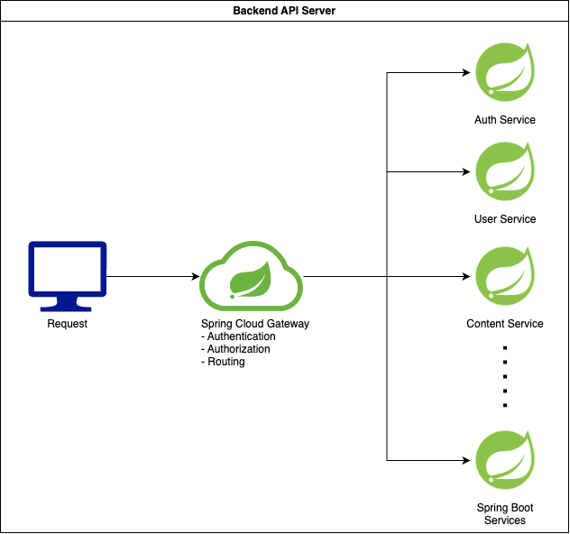

# Backend API Server 
개인 프로젝트에 쓰이는 Backend 서버  

## 서비스 구성


## CICD 구성  


---
## Getting Started
깃허브 URL: https://github.com/dev-montyoh/backend-api-server  
HTTPS clone URL: https://github.com/dev-montyoh/backend-api-server.git  
깃허브 프로젝트 URL: https://github.com/users/dev-montyoh/projects/4

---
## Local 개발 환경 구성
### 공통
```
1. IDE는 IntelliJ 를 사용함.

2. Git Clone -> Root 의 build.gradle 우클릭 -> Link Gradle Project 클릭 -> gradle build 확인 후 진행
```

### Docker 사용 시
```
1. Docker 설치

2. Gradle 에서 :build setup:buildLocalSetup 실행
    - src/main/resources/db/docker-compose.yaml 직접 실행 가능

3. Docker 에 DB 컨테이너 확인

4. DB 접속 확인
    - application.yaml local 프로필 DB 정보 참고

5. Application 실행
```

### 로컬 DB 사용 시
```
1. MySQL 8.0 설치

2. 다음 위치 SQL 문 실행
    - src/main/resources/db/database/schema_initialisation.sql

3. DB 접속 확인
    - application.yaml local 프로필 DB 정보 참고

4. Application 실행
```

## Git Flow
### branch 구조
```
origin
    ㄴ master
    ㄴ develop
    ㄴ features
        ㄴ branch1...
        ㄴ branch2...
```
```
1. develop 기준으로 features/branch1... 와 같이 브랜치 생성

2. 개발 완료 후 develop 으로 Pull Request 생성, Merge

(추후 변경 예정)
```

---